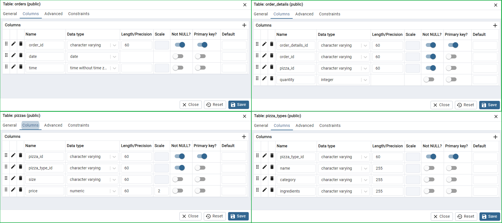
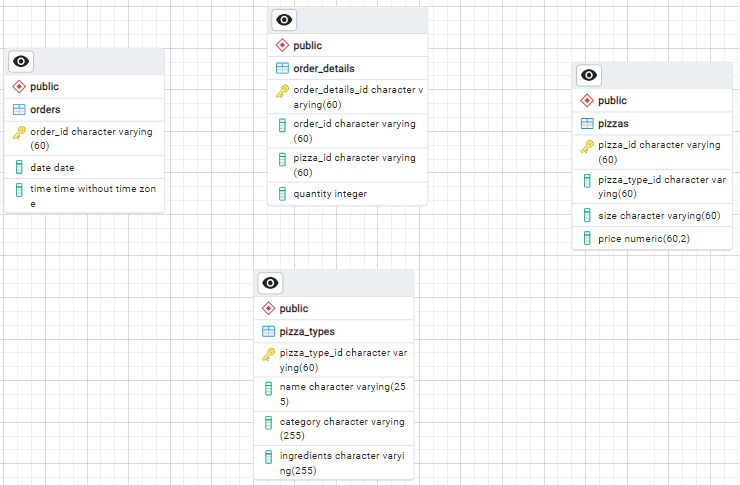
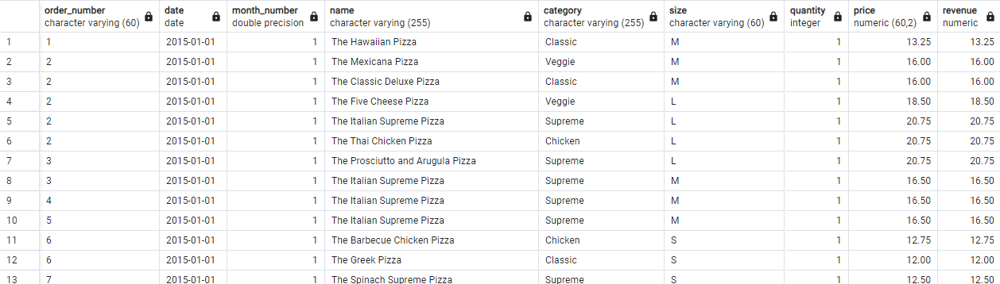
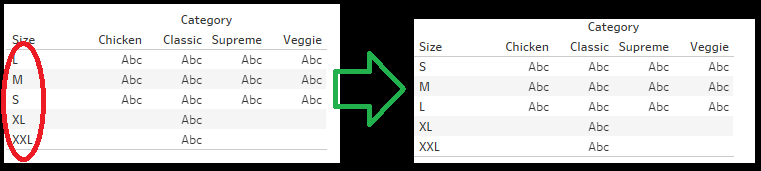
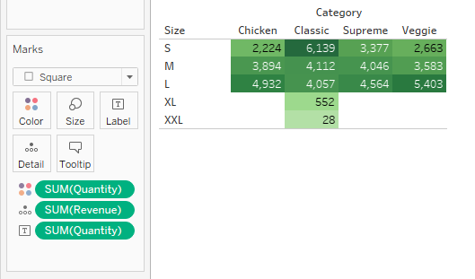

# Pizza Sales Analysis

 
### Introduction
Who doesn't love pizza? I embarked on this project fueled by my passion for pizza, alongside the opportunity to apply my skills in SQL and Tableau. The dataset I discovered on Kaggle was already clean, with data organized into various tables with corresponding primary keys. My next step involves transferring this data into PostgreSQL. After addressing some initial inquiries through SQL queries, I will extract the necessary data for visualization in Tableau.

In this project, I will adhere to the Data Analyst process, which entails the following steps:

1. ***Asking the question***
2. ***Getting the data***
3. ***Investigating the data***
4. ***Preparing the data***
5. ***Analyzing the data***
6. ***Presenting the results***

### Asking the question
Here are some question I am interested with:
1. Are there any anomalies within the total sales per month?
2. Which category (e.g., Chicken, Vegetarian) and size have the highest number of pizzas sold?
3. What are the top 10 and bottom 10 pizzas in terms of sales?
4. How does the total sales performance vary over time?
5. Which days of the month have the highest total sales?
6. Can we track the total sales, total pizzas sold, and average price per pizza?

### Getting the data
Since we already have questions to be answered using the data, we will now download the dataset from Kaggle. Here is the [link.](https://www.kaggle.com/datasets/mysarahmadbhat/pizza-place-sales).

### Investigating the data
As I investigate, it becomes evident that the dataset has been granularized into multiple tables. This makes the SQL approach advantageous, as we can import this data into the database since it is already cleaned. I explore all the tables, scrutinizing each value using the filter function, I did not encounter any missing or unusual values. Furthermore, I attempted to remove duplicates, but none were found. Therefore, I assume that the data is already clean. 
 

 
Table's PK and FK
 
 
### Preparing the data
In this process, I will import the data into PostgreSQL, allowing me to execute queries to address some of the questions posed during the question formulation phase.

To begin, I created a database named project2_DB in pgAdmin 4. Subsequently, I selected project2_DB in the Object Explorer, navigated to the Tools tab, and clicked on ERD tools. I then proceeded to create four tables: orders, order_details, pizza_types, and pizzas. For each table, I double-clicked to open it and synchronized the column names with the respective columns in the dataset.
 

 
Column name, data type, primary key
 
 

 
PGERD without connection
 

The next step involved establishing a one-to-many relationship. I began by selecting the order_details table in the ERD and clicking on the icon resembling '1M'. Then, in the Local Column, I chose order_id, referenced the table orders, and set the Reference Column to order_id.

Similarly, I applied the same logic to establish a one-to-many relationship between the order_details table and the pizzas table. Following that, I established a one-to-many relationship between the pizzas table and the pizza_types table.
 

 
Table connection
 
 
This time, we need to generate the SQL code to create the tables in our project2_DB. In the PGERD working sheet, we click on the Generate SQL icon. This action automatically creates a new working tab in pgAdmin 4. Then, we hit F5, navigate to the Object Explorer, and expand project2_DB. After expanding the Schema and Tables, we can see that our tables have now been created.
 

 
Tables created
 
 
Now, we will import the data into our tables in the database. In the Object Explorer, we click on the table, then select import and choose the file we're going to import. Since only the orders table and pizza_types have no foreign key, we can import this data first into their appropriate table. After that, we can import the pizzas table since it references the order_details table. Lastly, we can import the order_details data. It can be observed in the image below that when I first import the order_details data, it causes an error.
 

 
Importing processes
 
 

### Analyzing the data
In this phase, I will address all questions using PostgreSQL queries and Tableau. To answer question number one "Are there any anomalies within the total sales per month?", I will click on project2_DB in PostgreSQL in the Object Explorer, then right-click and select Query Tool. I will then create a temporary table using the query image below:
 

 
Creating temp table
 
 
After that, I will use the query provided in the image below. Then, I will click on the Graph Visualiser icon in the Data Output. In the Graph Visualiser, I will set Month on the X-axis and monthly_revenue on the Y-axis. Then, I will click Generate.
 

 
Query monthly total revenue
 
 
As observed from the graph, there are no significant peaks evident. This suggests that there are no anomalies in the monthly revenue data.
 

 
Generating the graph
 
 
To answer question number two, "Which category (e.g., Chicken, Vegetarian) and size have the highest number of pizzas sold?", I will execute the following query: 
***SELECT * FROM req_pizza_analysis***  
 

 
Data output
 
 
Then, I will download this result so I can connect with it in Tableau Public.Since its a CSV file, in Tableu Public, I click Text file and navigate the file I have download from PostgreSQL. I click Sheet 1, drag Category to Columns, and Size to Rows. I will arrange the Size field to display in the following order: S, M, L, XL, XXL. As for the Category, I will maintain its current arrangement.
 

 
Heatmap skeleton
 
 
After this, I will drag the Quantity into the Marks Card and assign it to the Color. Then, I will add Revenue to the Detail shelf, and Quantity again to the Text shelf, ensuring all measures are set to sum. Additionally, in the Marks Card, I will change the mark type from Automatic to Square to create a heatmap-like visual. Since I prefer green, I will customize the color by clicking on Color in the Marks Card. I will rename this sheet into 'HeatMap' and title to 'Category vs Size Heatmap'.

As we can observe here, the darker the color, the higher the number of pizzas being sold. When we hover our cursor over a particular box, it will display details about the total revenue for that specific pizza category and size. It's evident from the dataset that the all-time highest pizza sold is from Category: Classic, Size: Small, with a quantity of 6,139 pizzas sold and total sales of $69,870.
 

 
Heatmap category and size
 
 

