# Pizza Sales Analysis

 
### Introduction
Who doesn't love pizza? I embarked on this project fueled by my passion for pizza, alongside the opportunity to apply my skills in SQL and Tableau. The dataset I discovered on Kaggle was already clean, with data organized into various tables with corresponding primary keys. My next step involves transferring this data into PostgreSQL. After addressing some initial inquiries through SQL queries, I will extract the necessary data for visualization in Tableau.

In this project, I will adhere to the Data Analyst process, which entails the following steps:

1. ***Asking the question***
2. ***Getting the data***
3. ***Investigating the data***
4. ***Preparing the data***
5. ***Analyzing the data***
6. ***Presenting the results***

### Asking the question
Here are some question I am interested with:
1. Are there any anomalies within the total sales per month?
2. Which category (e.g., Chicken, Vegetarian) and size have the highest number of pizzas sold?
3. What are the top 10 and bottom 10 pizzas in terms of sales?
4. How does the total sales performance vary over time?
5. Which days of the month have the highest total sales?
6. Can we track the total sales, total pizzas sold, and average price per pizza?

### Getting the data
Since we already have questions to be answered using the data, we will now download the dataset from Kaggle. Here is the [link.](https://www.kaggle.com/datasets/mysarahmadbhat/pizza-place-sales)

### Investigating the data
As I investigate, it becomes evident that the dataset has been granularized into multiple tables. This makes the SQL approach advantageous, as we can import this data into the database since it is already cleaned. I explore all the tables, scrutinizing each value using the filter function, I did not encounter any missing or unusual values. Furthermore, I attempted to remove duplicates, but none were found. Therefore, I assume that the data is already clean. 
 

 
Table's PK and FK
 
 
### Preparing the data
In this process, I will import the data into PostgreSQL, allowing me to execute queries to address some of the questions posed during the question formulation phase.

To begin, I created a database named project2_DB in pgAdmin 4. Subsequently, I selected project2_DB in the Object Explorer, navigated to the Tools tab, and clicked on ERD tools. I then proceeded to create four tables: orders, order_details, pizza_types, and pizzas. For each table, I double-clicked to open it and synchronized the column names with the respective columns in the dataset.
 
<a href="#">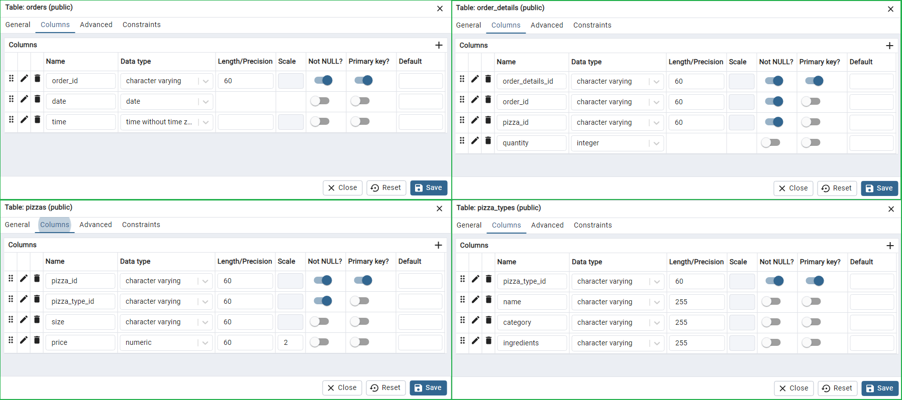</a>
 
Column name, data type, primary key
 
 
<a href="#">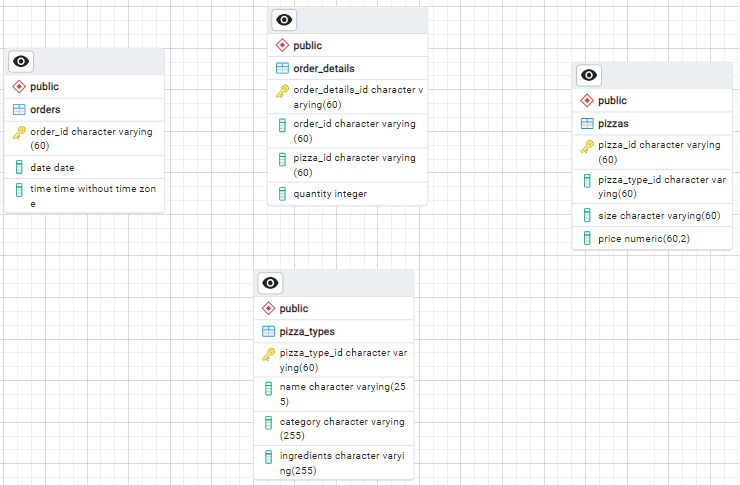</a>
 
PGERD without connection
 

The next step involved establishing a one-to-many relationship. I began by selecting the order_details table in the ERD and clicking on the icon resembling '1M'. Then, in the Local Column, I chose order_id, referenced the table orders, and set the Reference Column to order_id.

Similarly, I applied the same logic to establish a one-to-many relationship between the order_details table and the pizzas table. Following that, I established a one-to-many relationship between the pizzas table and the pizza_types table.
 

 
Table connection
 
 
This time, we need to generate the SQL code to create the tables in our project2_DB. In the PGERD working sheet, we click on the Generate SQL icon. This action automatically creates a new working tab in pgAdmin 4. Then, we hit F5, navigate to the Object Explorer, and expand project2_DB. After expanding the Schema and Tables, we can see that our tables have now been created.
 

 
Tables created
 
 
Now, we will import the data into our tables in the database. In the Object Explorer, we click on the table, then select import and choose the file we're going to import. Since only the orders table and pizza_types have no foreign key, we can import this data first into their appropriate table. After that, we can import the pizzas table since it references the order_details table. Lastly, we can import the order_details data. It can be observed in the image below that when I first import the order_details data, it causes an error.
 

 
Importing processes
 
 

### Analyzing the data
In this phase, I will address all questions using PostgreSQL queries and Tableau. To answer question number one "Are there any anomalies within the total sales per month?", I will click on project2_DB in PostgreSQL in the Object Explorer, then right-click and select Query Tool. I will then create a temporary table using the query image below:
 

 
Creating temp table
 
 
After that, I will use the query provided in the image below. Then, I will click on the Graph Visualiser icon in the Data Output. In the Graph Visualiser, I will set Month on the X-axis and monthly_revenue on the Y-axis. Then, I will click Generate.
 

 
Query monthly total revenue
 
 
As observed from the graph, there are no significant peaks evident. This suggests that there are no anomalies in the monthly revenue data.
 

 
Generating the graph
 
 
To answer question number two, "Which category (e.g., Chicken, Vegetarian) and size have the highest number of pizzas sold?", I will execute the following query: 
***SELECT * FROM req_pizza_analysis***  
 
<a href="#">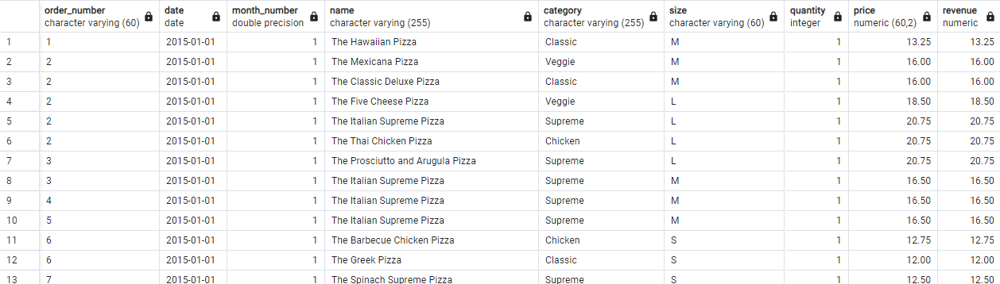</a>
 
Data output
 
 
Then, I will download this result so I can connect with it in Tableau Public.Since its a CSV file, in Tableu Public, I click Text file and navigate the file I have download from PostgreSQL. I click Sheet 1, drag Category to Columns, and Size to Rows. I will arrange the Size field to display in the following order: S, M, L, XL, XXL. As for the Category, I will maintain its current arrangement.
 
<a href="#">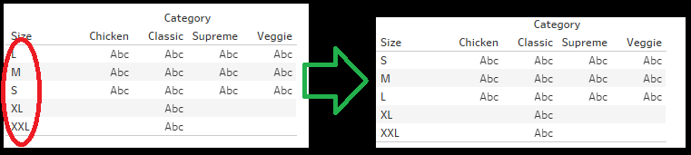</a>
 
Heatmap skeleton
 
 
After this, I will drag the Quantity into the Marks Card and assign it to the Color. Then, I will add Revenue to the Detail shelf, and Quantity again to the Text shelf, ensuring all measures are set to sum. Additionally, in the Marks Card, I will change the mark type from Automatic to Square to create a heatmap-like visual. Since I prefer green, I will customize the color by clicking on Color in the Marks Card. I will rename this sheet into 'HeatMap' and title to 'Category vs Size Heatmap'.

As we can observe here, the darker the color, the higher the number of pizzas being sold. When we hover our cursor over a particular box, it will display details about the total revenue for that specific pizza category and size. It's evident from the dataset that the all-time highest pizza sold is from Category: Classic, Size: Small, with a quantity of 6,139 pizzas sold and total sales of $69,870.
 
<a href="#">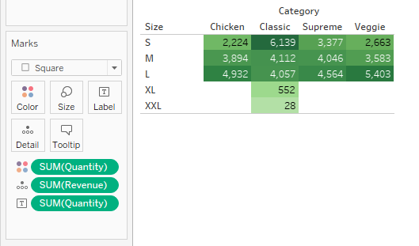</a>
 
Heatmap category and size
 
 
To address the third question, "What are the top 10 and bottom 10 pizzas in terms of sales?", I will create two additional sheets named Top10 and Bottom10. In the Top10 sheet, I will drag Quantity to Columns and Name to Rows. This will display all pizza names and their total quantity sold. To show only the top 10, I will right-click the Name field in Rows, then select Filter, click on Top, choose By field, and select Quantity with Sum aggregation. After setting it to display the top 10, I'll click OK.

To enlarge the bars, I will switch from the standard view to the entire view. I'll customize the color by holding down ctrl and dragging the SUM(Quantity). Personally, I prefer green, so I will change it to green. Above the bars, there will be icon that allow changing the order. In my case, I want it to be in descending order.

From the result, it will be evident which pizzas are in the top 10, with 'The Classic Deluxe Pizza' being the most popular, having sold 2,453 units so far.
 
<a href="#">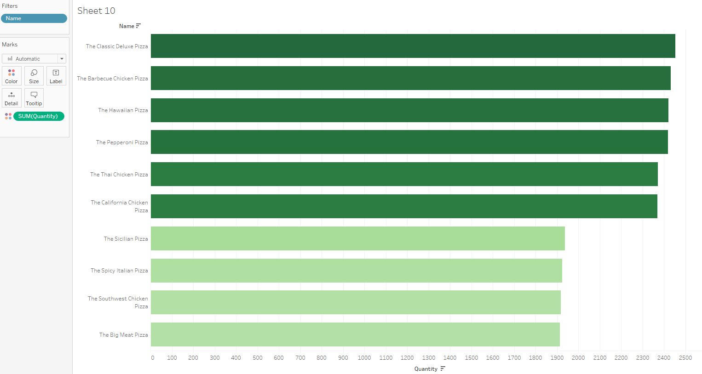</a>
 
Top 10
 
 
For the Bottom 10, I will follow the same steps in the Bottom10 Sheet. However, in the Name filter under the By fields, I will change Top to Bottom, and then click OK. It is much faster to duplicate the Top10 Sheet, rename it, and then edit the filters to show the Bottom 10.

Regarding the order, in this case, I will set it to ascend so that the pizzas with the lowest sales appear at the top.

Now, we can clearly observe the bottom 10, with the lowest score going to 'The Brie Carre Pizza', having sold only 490 units.
 
<a href="#">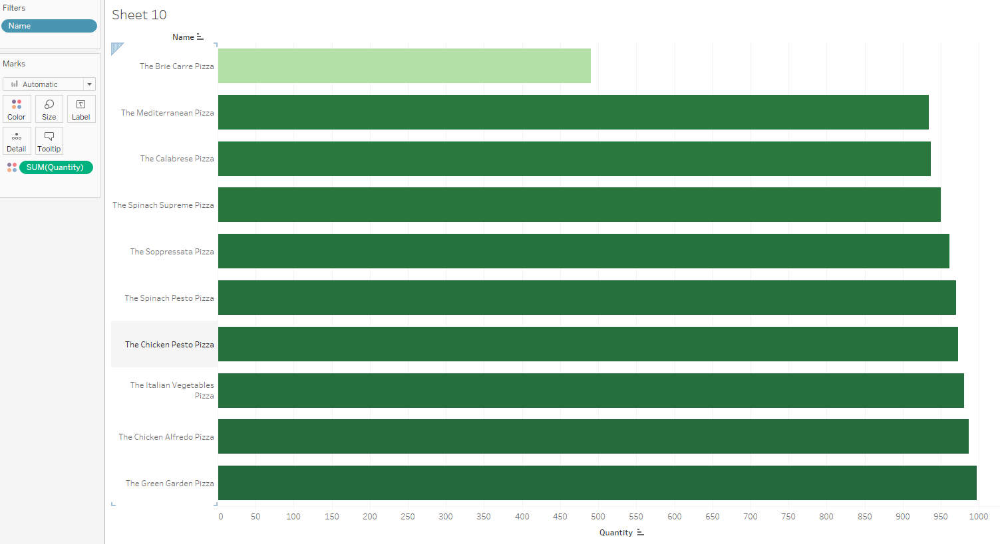</a>
 
Bottom 10
 
 

To answer question number four, "How does the total sales performance vary over time?", I will add another sheet and name it LineChart. I will change the title to Daily Total Sales. The first step is to add the Date to the Columns. Then, I will click the down arrow and change the Year to Day with the 'Month day, year' style.

Next, I will add 'SUM(Revenue)' to Rows. As we can observe, in the daily performance of sales, there are some high peaks and low peaks. The highest peak occurs on November 27, 2015, with a total sales of $4,422, while the lowest peak is on March 22, 2015, with a total sales of $1,259.
 
 
<a href="#">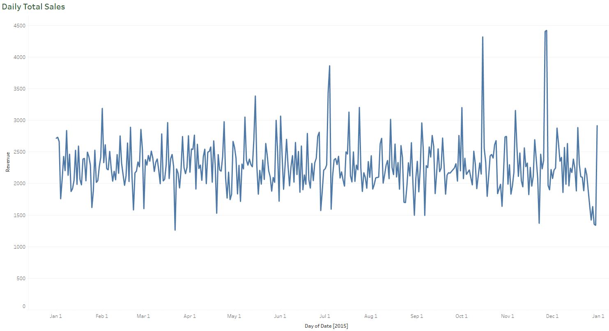</a>
 
All time daily sales
 
 

To address the question number five "Which days of the month have the highest total sales?", I will create a new sheet. In this sheet, I will drag the field Date to both Columns and Rows. In the Column Date, I will change it from Year to Weekday. Then, for the Rows Date, I will change Year to Week. I'll achieve this by navigating to More, then clicking Custom, and choosing Week numbers, leaving it as Date Part.

After doing this, I will add a Filters box with Date, and select a specific month, for example, January, then click OK. To display the heatmap color in my calendar-like visualization, I will drag SUM(Revenue) to Marks Color. Additionally, to add numbers to my calendar heatmap, I will add Date, setting it to DAY, to the Marks Text. Since I want it in a color box format, I will change the mark type from Automatic to Square. Then, I will customize the color to green.

With this setup, I can visually observe that the darker the color, the higher the total sales for that day of the month. For example, in this visual, I can directly see that January 8, 2015, has the highest sales for that month. By adjusting the filter, I can observe all the days with the highest sales for each month. Here are the results: February 1, March 17, April 24, May 15, June 1, July 4, August 14, September 4, October 15, November 27, and December 31. 
 
<a href="#">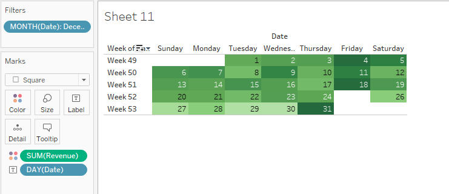</a>
 
Calendar heatmap
 
 
To address question number 6, "Can we track the total sales, total pizzas sold, and average price per pizza?", I will create three new sheets in Tableau Public, namely: BanSales, BanAvg.PizzaPrice, and TotalPizzaSold.

On the BanSales sheet, I will drag Revenue to Marks Text. To make the size of the number larger, I will click on Text in the Marks box, then click the three dots. Once it opens, I can change the font size. For example, I will change it to 24 Bold. On the next line, I will add "Total Sales" and adjust its font size to 9.
 
<a href="#">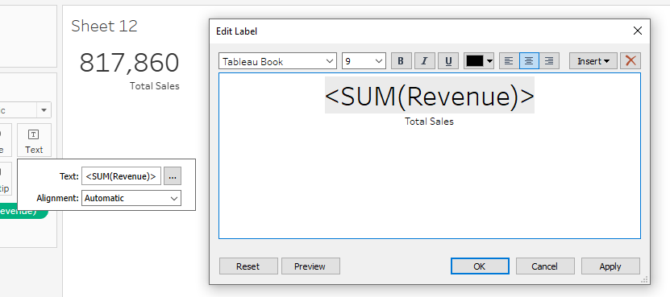</a>
 
Creating total sales bans
 
 
I want to add shapes behind my BANs. To do this, I will change Automatic from the Marks box to Shapes. Using Ctrl and the arrow keys, I will adjust the size of the shape to make it bigger. Next, I want to center the number within the shape. To achieve this, I will click on Label in the Marks box, then select alignment, and choose center alignment for all.

To change the shape, I will click on Shape in the Marks box, then select More Shapes. Since I have already downloaded some icons, I will change the default to the specific folder where I saved the icons. After selecting the desired icon, I will click OK.

To make my BANs more noticeable, I will click on Color in Marks and adjust the Opacity to around 50%.
 
<a href="#">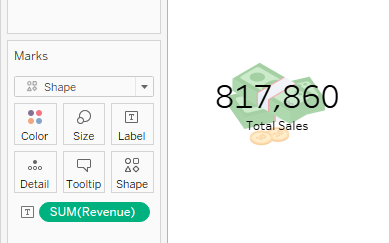</a>
 
Shapes into bans
 
 
The same editing logic applies to the other BANs sheets. For the BanAvg.PizzaPrice sheet, instead of Revenue in Marks Label, I will use AVG(Price). Similarly, for the TotalPizzaSold sheet, I will select SUM(Quantity) in the Marks Label.
 
<a href="#">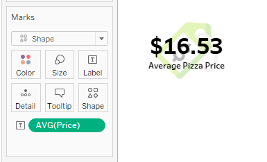</a>
 
Average pizza price BANs
 
 
<a href="#">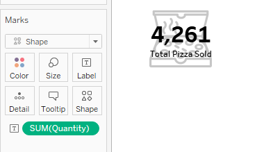</a>
 
Total pizza sold BANs
 
 
These BANs will dynamically track every time I use filters. In the next phase, presenting the results of the Data Analyst Process, this question will be clearly answered.

### Presenting the results
Now it's time to present my results by creating a dashboard. The creation of this dashboard is influenced by Mo Chen. You may watch his video by clicking the image below.
 

 
      

 

You may check my dashboard here: [Tableau Link](https://public.tableau.com/app/profile/virfrance.gabas/viz/2ndProj/PizzaDashBoard).
As you can see, my filters are the Month, Calendar, Size, and Category. You can select a month to check daily sales performance based on revenue sales, a heatmap that visualizes which pizza category and size are most sold in that particular month, a calendar heatmap visualizing every day of the month with respect to its total revenue, BANs representing Total Sales, Total Pizza Sold, and Average Pizza Price for the selected month from the filters, and the Distribution of Pizza Prices, which visualizes the mean price of the pizza. Below are the top 10 and bottom 10 pizzas in that particular month.

The Calendar filter can filter every chart and BANs in the dashboard except for the Daily Total Sales. I achieved this by referencing Mo Chen's video. To implement this, I clicked on the Dashboard tab, then navigated to Actions. In the Actions box, I checked Filter where the Source is my Calendar, then edited it, and unchecked my Line Chart before hitting OK. Now, you can filter by clicking on one number in the calendar or more. Additionally, you can press Ctrl to add more days you want as a filter.
 
<a href="#">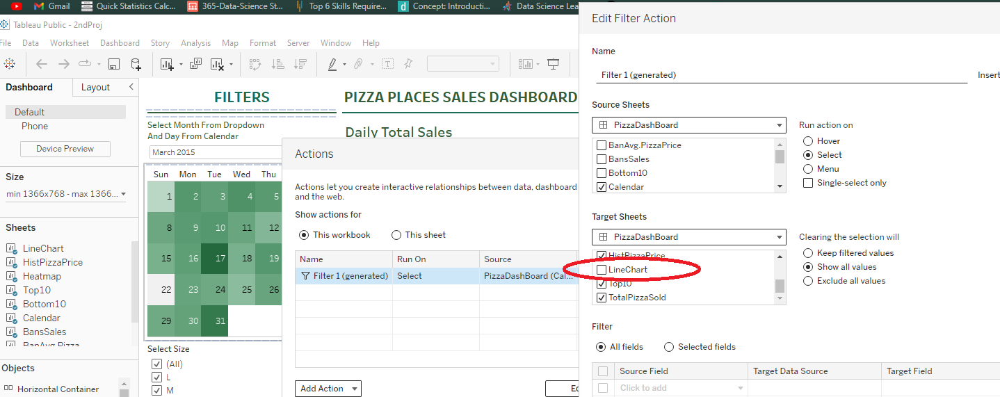</a>
 
Calendar to not filter line chart
 
 
The Select Size and Select Category filters affect all the charts and BANs, as well as the Calendar.

All these filters track the total sales, total pizzas sold, and average price of the pizza, which addresses question number six: 'Can we track the total sales, total pizzas sold, and average price per pizza?'

### Conclusion
Based on the analysis conducted using PostgreSQL and Tableau, several key insights have been uncovered:

- Monthly revenue data does not exhibit any significant anomalies, indicating stability in sales performance over time.

- The highest-selling pizza in the dataset belongs to the Classic category, with a Small size, totaling 6,139 units sold and generating $69,870 in revenue.

- 'The Classic Deluxe Pizza' emerges as the most popular pizza, with 2,453 units sold, highlighting its strong demand among customers.

- Conversely, 'The Brie Carre Pizza' ranks as the least popular option, with only 490 units sold.

- Daily sales performance demonstrates fluctuations, with notable peaks and troughs. For instance, the highest peak occurred on November 27, 2015, reaching a total sales figure of $4,422, while the lowest peak was recorded on March 22, 2015, with total sales of $1,259.

- Additionally, specific days of each month consistently exhibit the highest sales performance. Notable examples include January 8, February 1, March 17, April 24, May 15, June 1, July 4, August 14, September 4, October 15, November 27, and December 31.

In conclusion, the creation of BANs and the use of dynamic filters in the Tableau dashboard have enabled effective tracking of total pizzas sold and average pizza prices. These tools have facilitated a comprehensive understanding of sales trends and performance metrics, providing valuable insights for informed decision-making.

Thank you for reviewing the data analysis. Have a pleasant day!
